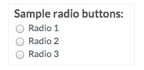
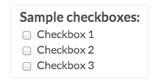

# Annotated Data: Helper Functions/Scripts

This is a collection of different helper functions I have used in various data labeling projects.
In these projects, individual data points are annotated by several data annotators/reviewers. 
These reviewers each give a label judgment.

## Application 
These functions/scripts are intended to

- help create human-reviewable outputs, e.g. for further manual review in a spreadsheet (`human_review_helpers.R`)
- aggregate all given judgments to a final *label* or label set for the datapoint (majority label, union of labels) (`label_aggregation_helpers.R`)
- check the judgments given by individual annotators to review their performance, or compare to "gold" labels (`annotator_review_helpers.R`)

## Expected format
These functions expect the labeled datasets in *CSV format*.

Different *dummy datasets* are provided to showcase the expected input and output for different formats (**radio buttons** vs **checkboxes**).

On common data labeling platforms, annotators give their judgments in the following format:

In order to work with output from common data labeling platforms, unless stated
otherwise the functions take a single string that contains all given judgments (e.g. "label1/label2/label3").

